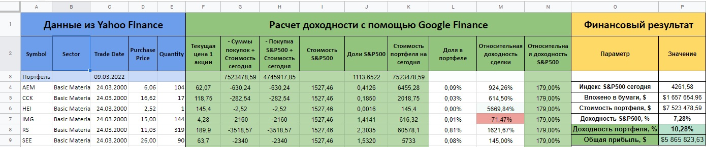
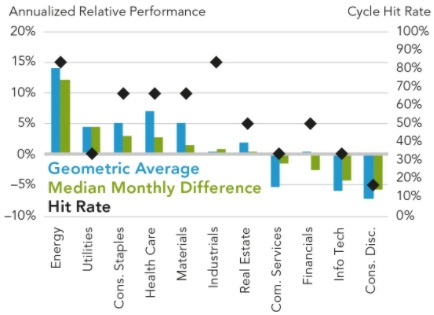
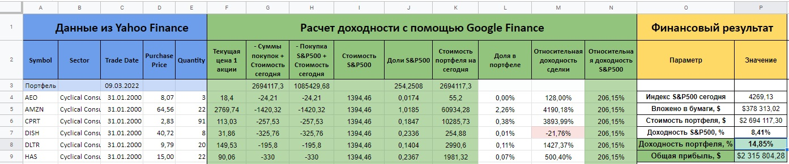

## Research in the financial field

### Portfolio formation and optimization

Comparison of the strategy of uniform purchases of shares every quarter

### Market Research

Dynamics of sectors in the economic last cycle

Comparison of the strategy of uniform purchases of shares every quarter (Defensive sector) and comparison in S&P

